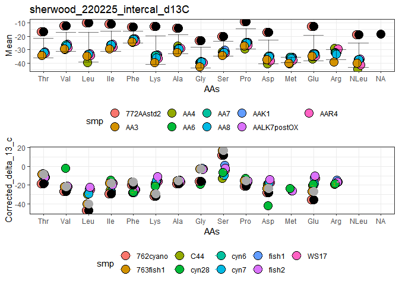

<!-- README.md is generated from README.Rmd. Please edit that file -->

# ProcessIsodataOuts

<!-- badges: start -->

[](https://travis-ci.com/catrinanowakowski/process_isodata_outs)
[](https://github.com/catrinanowakowski/process_isodata_outs/actions)
<!-- badges: end -->

The goal of ProcessIsodataOuts is to read files from isodat, assign AA
peak names, and then correct sample data based on standard runs. This
package is still under development.

## Installation

You can install the development version from
[GitHub](https://github.com/) with:

``` r
# install.packages("devtools")
devtools::install_github("catrinanowakowski/process_isodata_outs")
```

## Example

This is a basic example which shows you how to solve a common problem:

``` r
library(ProcessIsodataOuts)


file_data <- c("C:/Thermo/Isodat NT/Global/User/Conflo IV Interface/Conflo IV Interface/Results/sherwood_220225_intercal_d13C/data")
AAStd_name <-  "772AAstd2"
AA_list <- c("Ala", "Gly", "Thr", "Ser", "Val", "Leu", "Ile", "NLeu", "Pro", "Asp", "Glu", "Phe", "Tyr", "Lys")
C_N <- "C"
fl_nm <- "sherwood_220225_intercal_d13C"
order_AAs <- "Type" # "Type"
cyano <- "762cyano"
fish_muscle <- "763fish1"


# # ## A separate place where you want your final sample data to be stored:
file_save <- "C:/Users/EcoGeoChemLab/Documents"
# 
# ## Where this file you are using now lives:
# file_home <- "C:/Users/EcoGeoChemLab/isodat_processing"

## Carbon AA std files for your lab
file_save_AAstds_C <- "C:/Users/EcoGeoChemLab/Documents/AAStds_C"
## Carbon Labstd files for your lab
file_save_stds_C <- "C:/Users/EcoGeoChemLab/Documents/Stds_C"


## Nitrogen AA std files for your lab
file_save_AAstds_N <- "C:/Users/EcoGeoChemLab/Documents/AAStds_N"
## Nitrogen Labstd files for your lab
file_save_stds_N <- "C:/Users/EcoGeoChemLab/Documents/Stds_N"

##############################################################################
##############################################################################
## Code you shouldn't need to touch:

# file_sorc <- paste0(file_home, "/sorc") ## Where your source files are stored (These you should never have to touch, and should be the same if you are running normal data corrections or std test runs)

#######################
# source(paste0(file_sorc, "/process_CSIA_full_run.r"))     
outs <- process_CSIA_full_run()
#> Warning: package 'isoreader' was built under R version 4.1.2
#> 
#> Attaching package: 'isoreader'
#> The following object is masked from 'package:stats':
#> 
#>     filter
#> Info: preparing to read 1 data files (all will be cached)...
#> Info: reading file '220225_082121__772AAstd2_C_R1_330uLcut_100EA.dxf' from ...
#> Info: finished reading 1 files in 0.54 secs
#> [1] 2
#> Info: preparing to read 1 data files (all will be cached)...
#> Info: reading file '220225_091541__772AAstd2_C_R2_330uLcut_100EA.dxf' from ...
#> Info: finished reading 1 files in 0.20 secs
#> [1] 3
#> Info: preparing to read 1 data files (all will be cached)...
#> Info: reading file '220225_101003__772AAstd2_C_R3_330uLcut_100EA.dxf' from ...
#> Info: finished reading 1 files in 0.29 secs
#> [1] 4
#> Info: preparing to read 1 data files (all will be cached)...
#> Info: reading file '220225_110424__772AAstd2_C_R4_330uLcut_100EA.dxf' from ...
#> Info: finished reading 1 files in 0.24 secs
#> [1] 5
#> Info: preparing to read 1 data files (all will be cached)...
#> Info: reading file '220225_115835__762cyano_C_R1_330uLcut_100EA.dxf' from c...
#> Info: finished reading 1 files in 0.20 secs
#> [1] 6
#> Info: preparing to read 1 data files (all will be cached)...
#> Info: reading file '220225_125244__762cyano_C_R2_330uLcut_100EA.dxf' from c...
#> Info: finished reading 1 files in 0.17 secs
#> [1] 7
#> Info: preparing to read 1 data files (all will be cached)...
#> Info: reading file '220225_134705__762cyano_C_R3_330uLcut_100EA.dxf' from c...
#> Info: finished reading 1 files in 0.17 secs
#> [1] 8
#> Info: preparing to read 1 data files (all will be cached)...
#> Info: reading file '220225_144129__762cyano_C_R4_330uLcut_100EA.dxf' from c...
#> Info: finished reading 1 files in 0.18 secs
#> [1] 9
#> Info: preparing to read 1 data files (all will be cached)...
#> Info: reading file '220225_153541__763fish1_C_R1_330uLcut_100EA.dxf' from c...
#> Info: finished reading 1 files in 0.19 secs
#> [1] 10
#> Info: preparing to read 1 data files (all will be cached)...
#> Info: reading file '220225_162949__763fish1_C_R2_330uLcut_100EA.dxf' from c...
#> Info: finished reading 1 files in 0.19 secs
#> [1] 11
#> Info: preparing to read 1 data files (all will be cached)...
#> Info: reading file '220225_172359__763fish1_C_R3_330uLcut_100EA.dxf' from c...
#> Info: finished reading 1 files in 0.17 secs
#> [1] 12
#> Info: preparing to read 1 data files (all will be cached)...
#> Info: reading file '220225_181810__763fish1_C_R4_330uLcut_100EA.dxf' from c...
#> Info: finished reading 1 files in 0.17 secs
#> [1] 13
#> Info: preparing to read 1 data files (all will be cached)...
#> Info: reading file '220225_200830__772AAstd2_C_R5_330uLcut_100EA.dxf' from ...
#> Info: finished reading 1 files in 0.17 secs
#> [1] 14
#> Info: preparing to read 1 data files (all will be cached)...
#> Info: reading file '220225_210242__772AAstd2_C_R6_330uLcut_100EA.dxf' from ...
#> Info: finished reading 1 files in 0.18 secs
#> [1] 15
#> Info: preparing to read 1 data files (all will be cached)...
#> Info: reading file '220225_215704__772AAstd2_C_R7_330uLcut_100EA.dxf' from ...
#> Info: finished reading 1 files in 0.18 secs
#> [1] 16
#> Info: preparing to read 1 data files (all will be cached)...
#> Info: reading file '220225_225115__765chlor1_C_R1_330uLcut_100EA.dxf' from ...
#> Info: finished reading 1 files in 0.18 secs
#> [1] 17
#> Info: preparing to read 1 data files (all will be cached)...
#> Info: reading file '220225_234540__765chlor1_C_R2_330uLcut_100EA.dxf' from ...
#> Info: finished reading 1 files in 0.18 secs
#> [1] 18
#> Info: preparing to read 1 data files (all will be cached)...
#> Info: reading file '220226_003950__765chlor1_C_R3_330uLcut_100EA.dxf' from ...
#> Info: finished reading 1 files in 0.19 secs
#> [1] 19
#> Info: preparing to read 1 data files (all will be cached)...
#> Info: reading file '220226_013359__765chlor1_C_R4_330uLcut_100EA.dxf' from ...
#> Info: finished reading 1 files in 0.19 secs
#> [1] 20
#> Info: preparing to read 1 data files (all will be cached)...
#> Info: reading file '220226_022809__767AYS_C_R1_330uLcut_100EA.dxf' from cac...
#> Info: finished reading 1 files in 0.18 secs
#> [1] 21
#> Info: preparing to read 1 data files (all will be cached)...
#> Info: reading file '220226_032219__767AYS_C_R2_330uLcut_100EA.dxf' from cac...
#> Info: finished reading 1 files in 0.17 secs
#> [1] 22
#> Info: preparing to read 1 data files (all will be cached)...
#> Info: reading file '220226_041629__767AYS_C_R3_330uLcut_100EA.dxf' from cac...
#> Info: finished reading 1 files in 0.17 secs
#> [1] 23
#> Info: preparing to read 1 data files (all will be cached)...
#> Info: reading file '220226_051038__767AYS_C_R4_330uLcut_100EA.dxf' from cac...
#> Info: finished reading 1 files in 0.17 secs
#> [1] 24
#> Info: preparing to read 1 data files (all will be cached)...
#> Info: reading file '220226_060648__772AAstd2_C_R8_330uLcut_100EA.dxf' from ...
#> Info: finished reading 1 files in 0.16 secs
#> [1] 25
#> Info: preparing to read 1 data files (all will be cached)...
#> Info: reading file '220226_070110__772AAstd2_C_R9_330uLcut_100EA.dxf' from ...
#> Info: finished reading 1 files in 0.15 secs
#> [1] 26
#> Info: preparing to read 1 data files (all will be cached)...
#> Info: reading file '220226_075531__772AAstd2_C_R10_330uLcut_100EA.dxf' from...
#> Info: finished reading 1 files in 0.17 secs
#> [1] 27
#> Info: preparing to read 1 data files (all will be cached)...
#> Info: reading file '220226_084941__772AAstd2_C_R11_330uLcut_100EA.dxf' from...
#> Info: finished reading 1 files in 0.20 secs
#> [1] 22
#> [1] 22
#> [1] 22
#> [1] 22
#> [1] 22
#> [1] 22
#> [1] 22
#> [1] 22
#> [1] 22
#> [1] 22
#> [1] 22
#> [1] 1
#> [1] "Ala"
#> [1] 2
#> [1] "Gly"
#> [1] 3
#> [1] "Thr"
#> [1] 4
#> [1] "Ser"
#> [1] 5
#> [1] "Val"
#> [1] 6
#> [1] "Leu"
#> [1] 7
#> [1] "Ile"
#> [1] 8
#> [1] "NLeu"
#> [1] 9
#> [1] "Pro"
#> [1] 10
#> [1] "Asp"
#> [1] 11
#> [1] "Glu"
#> [1] 12
#> [1] "Phe"
#> [1] 13
#> [1] "Tyr"
#> [1] 14
#> [1] "Lys"
#> [1] 1
#> [1] "Ala"
#> [1] 2
#> [1] "Gly"
#> [1] 3
#> [1] "Thr"
#> [1] 4
#> [1] "Ser"
#> [1] 5
#> [1] "Val"
#> [1] 6
#> [1] "Leu"
#> [1] 7
#> [1] "Ile"
#> [1] 8
#> [1] "NLeu"
#> [1] 9
#> [1] "Pro"
#> [1] 10
#> [1] "Asp"
#> [1] 11
#> [1] "Glu"
#> [1] 12
#> [1] "Phe"
#> [1] 13
#> [1] "Tyr"
#> [1] 14
#> [1] "Lys"
#> [1] 1
#> [1] "Ala"
#> [1] 2
#> [1] "Gly"
#> [1] 3
#> [1] "Thr"
#> [1] 4
#> [1] "Ser"
#> [1] 5
#> [1] "Val"
#> [1] 6
#> [1] "Leu"
#> [1] 7
#> [1] "Ile"
#> [1] 8
#> [1] "NLeu"
#> [1] 9
#> [1] "Pro"
#> [1] 10
#> [1] "Asp"
#> [1] 11
#> [1] "Glu"
#> [1] 12
#> [1] "Phe"
#> [1] 13
#> [1] "Tyr"
#> [1] 14
#> [1] "Lys"
#> [1] 1
#> [1] "Ala"
#> [1] 2
#> [1] "Gly"
#> [1] 3
#> [1] "Thr"
#> [1] 4
#> [1] "Ser"
#> [1] 5
#> [1] "Val"
#> [1] 6
#> [1] "Leu"
#> [1] 7
#> [1] "Ile"
#> [1] 8
#> [1] "NLeu"
#> [1] 9
#> [1] "Pro"
#> [1] 10
#> [1] "Asp"
#> [1] 11
#> [1] "Glu"
#> [1] 12
#> [1] "Phe"
#> [1] 13
#> [1] "Tyr"
#> [1] 14
#> [1] "Lys"
#> Warning: Removed 12 rows containing missing values (geom_point).
```


    #> Warning: Removed 16 rows containing missing values (geom_point).
    #> Warning: Removed 3 rows containing missing values (geom_point).

    #> Warning: Removed 3 rows containing missing values (geom_point).



    #> Warning: Removed 12 rows containing missing values (geom_point).
    #> Warning: Removed 16 rows containing missing values (geom_point).
    #> Warning: Removed 3 rows containing missing values (geom_point).

    #> Warning: Removed 3 rows containing missing values (geom_point).


``` r
all_fn_std_df <- outs$all_fn_std_df
all_fn_df <- outs$all_fn_df
```
